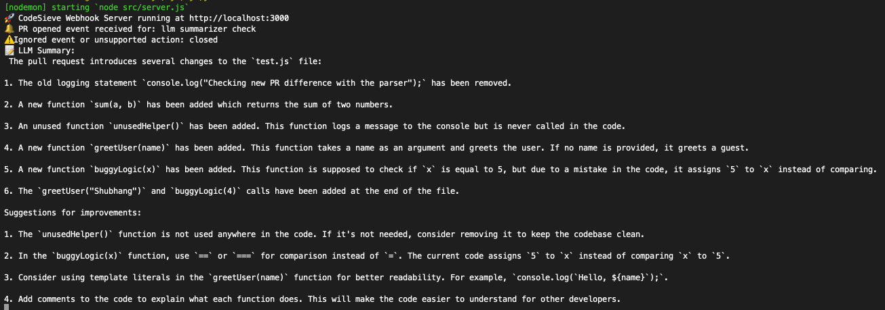

# CodeSieve

**CodeSieve** is an open-source dev tool that uses LLMs to automate pull request reviews by analyzing diffs, summarizing changes, and suggesting improvements — all integrated with GitHub.

## 🔧 Features

- GitHub Webhook Listener
- Diff Parser (Unified Diff → Code Chunks)
- LangChain + OpenAI for summarization and suggestions
- Inline and Summary Commenting
- Repo-specific config via `.codesieverc`
- Dockerized for easy deployment

## 📦 Tech Stack

- Node.js + Express
- LangChain + OpenAI API
- GitHub REST API + Webhooks
- Docker

## 🛠️ Getting Started

```bash
npm install
npm run dev
```

- feat: Introduces a new feature.
- fix: Patches a bug.
- docs: Updates or adds documentation.
- style: Changes that do not affect the meaning of the code (e.g., formatting). 
- refactor: Code changes that neither fix a bug nor add a feature.
- test: Adds or modifies tests.
- chore: Miscellaneous tasks such as updating build processes or auxiliary tools.

